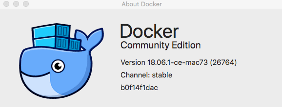
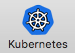
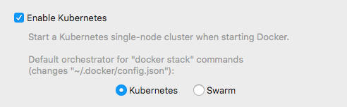
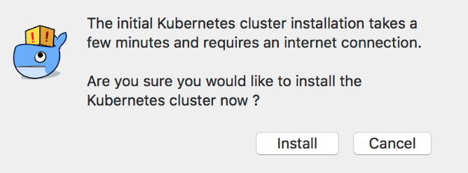
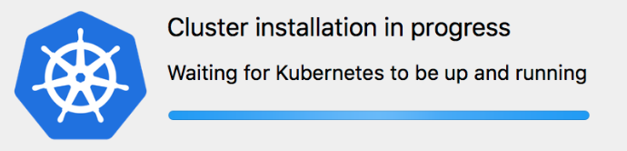
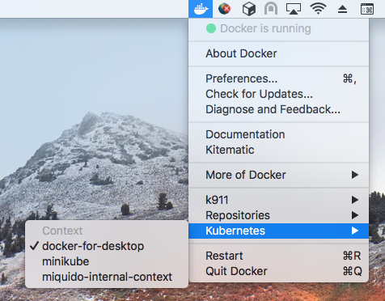
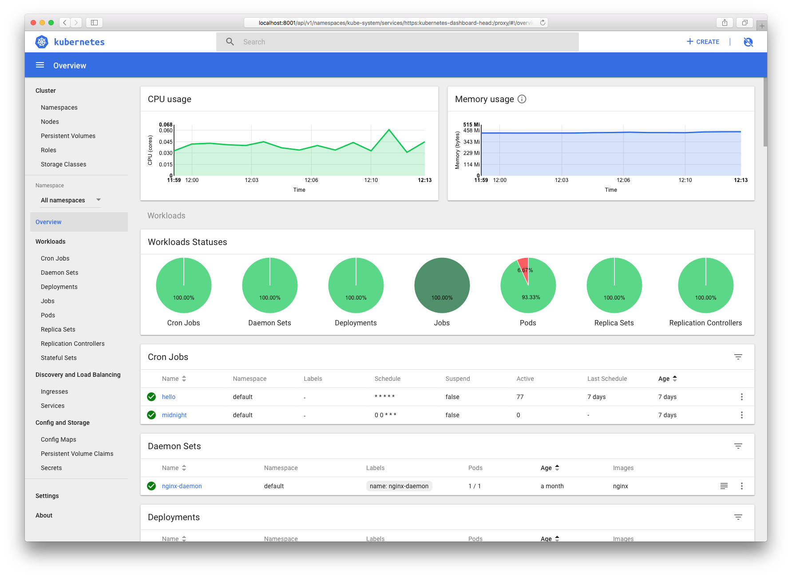
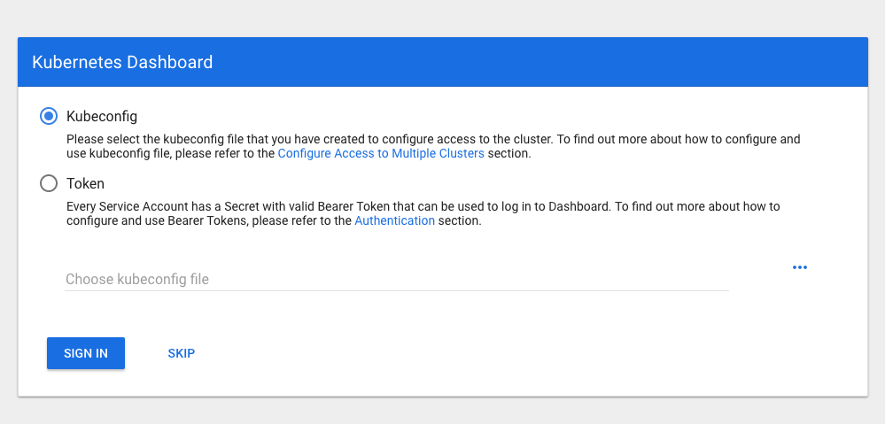

# Local Kubernetes Cluster (macOS)

This guide allows you to run single-node Kubernetes cluster directly on your local machine, to try out Kubernetes or develop with it.

- [Installation](#installation)
- [Usage](#usage)
- [FAQ](#faq)
- [Deploying Kubernetes Dashboard](#kubernetes-dashboard)

## Installation

0. Unless you're using Docker for mac already, uninstall everything regarding Docker and Kubernetes you've ever installed, e.g.:
    - `brew uninstall docker docker-compose docker-machine minikube kubectl`
    - Finder -> Applications -> remove Docker Toolbox

    If you don't remove them and install Docker for mac, they'll be overridden anyway.

    Remarks: Every container, volume, machine and image you've used will be lost.

1. Install or update "Docker for mac"

    https://docs.docker.com/docker-for-mac/install/

    Note: You always should keep your software up-to-date, but please ensure you've got version at least: "18.06.0-ce-mac70"

    To check your version on macOS toolbar, click Docker icon  and select "About Docker"

    

2. Once, you've installed successfully "Docker for mac" application:

    Select:  -> Preferences -> 

    Then check "Enable Kubernetes", select "Kubernetes" as default orchestrator and "Apply".

    

3. This will display a message that the Kubernetes cluster needs to be intially installed using internet connection.

    

    Click install.

3. Docker deamon and Kubernetes cluster will be ready in several minutes

    


## Usage

- Commands in your terminal `docker`, `docker-machine`, `docker-compose`, `kubectl` are accessible again, after Docker for mac installation, so you continue using them as usual.

- You may need to update your local application environment variables from ip addresses like `192.168.99.100` to `localhost` or `host.docker.internal`.

- Changing context is now possible via  -> Kubernetes -> Select context

     

## FAQ

### Previously I've used ip address 192.168.99.100 (or similar) to access docker  applications in container and on host machine (e.g. macOS terminal)

- Use `host.docker.internal` hostname in containers
- Docker for mac exposes container ports locally, so in macOS terminal you have to use `localhost` or `127.0.0.1` to connect with them, but if you want to use the same address in container and in macOS you can execute following command to bind host `host.docker.internal` to local ip address:
    
    ```bash
    echo "127.0.0.1 host.docker.internal" | sudo tee -a /etc/hosts
    ```

- [Docker for mac documentation reference](https://docs.docker.com/docker-for-mac/networking/#there-is-no-docker0-bridge-on-macos)

### I've messed up something and kubectl won't response.

- Go to  -> Preferences -> Reset Kubernetes cluster. If Kubernetes won't restart in 5 minutes, you've to "Reset disk image", so every image, container and volume you've created will be lost. 

## Kubernetes Dashboard
Kubernetes Dashboard is a general purpose, web-based UI for Kubernetes clusters. It allows users to manage applications running in the cluster and troubleshoot them, as well as manage the cluster itself.



See https://github.com/kubernetes/dashboard for more details.

Guide:

1. Execute following command

    ```bash
    $ kubectl apply -f https://raw.githubusercontent.com/kubernetes/dashboard/master/src/deploy/recommended/kubernetes-dashboard.yaml

    # secret/kubernetes-dashboard-certs created
    # serviceaccount/kubernetes-dashboard created
    # role.rbac.authorization.k8s.io/kubernetes-dashboard-minimal created
    # rolebinding.rbac.authorization.k8s.io/kubernetes-dashboard-minimal created
    # deployment.apps/kubernetes-dashboard created
    # service/kubernetes-dashboard created
    ```

2. Check whether deployment is already available

    ```bash
    $ kubectl get deployments/kubernetes-dashboard -n kube-system

    # NAME                   DESIRED   CURRENT   UP-TO-DATE   AVAILABLE   AGE
    # kubernetes-dashboard   1         1         1            1           37s
    ```

3. Proxy cluster network to your local machine

    ```bash
    $ kubectl proxy --port=8001 --api-prefix=

    # Starting to serve on 127.0.0.1:8001
    ```

4. Now you can visit Kubernetes Dashboard under this url: 

    http://localhost:8001/api/v1/namespaces/kube-system/services/https:kubernetes-dashboard:/proxy/

5. If following page will appear, click "skip" button

    

